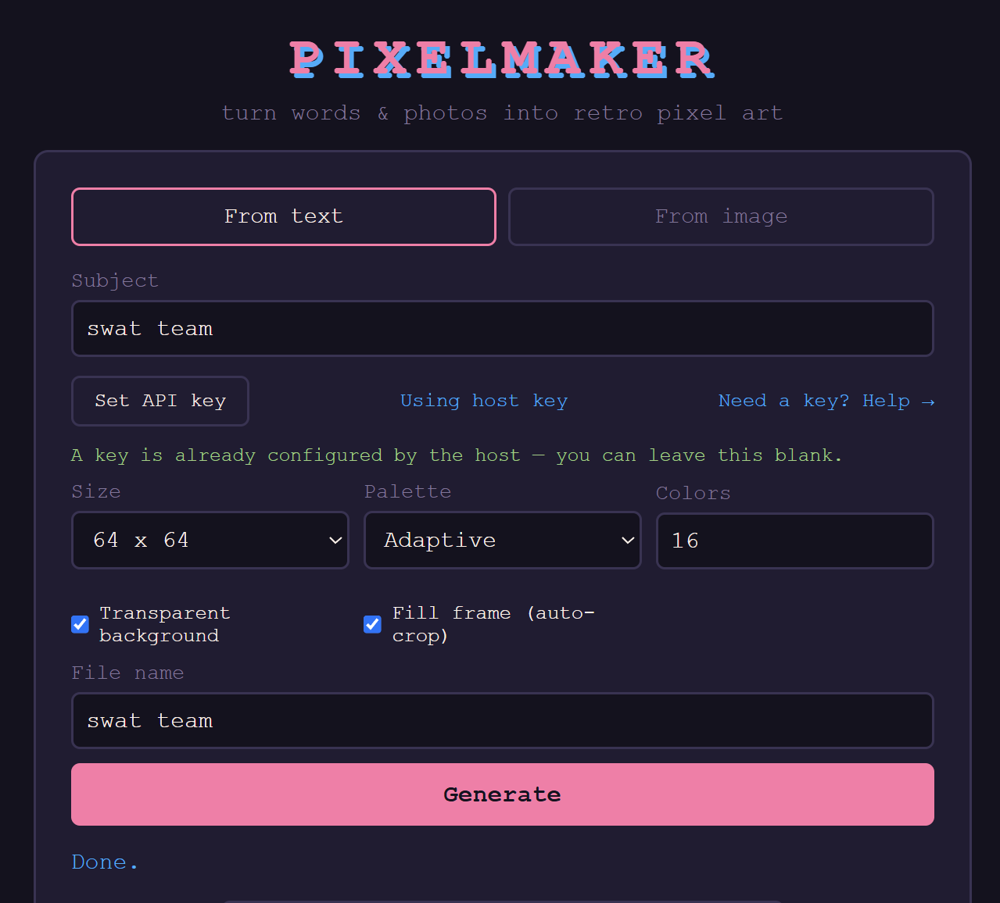
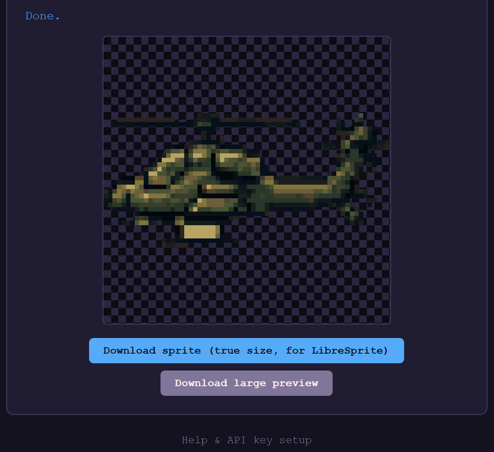
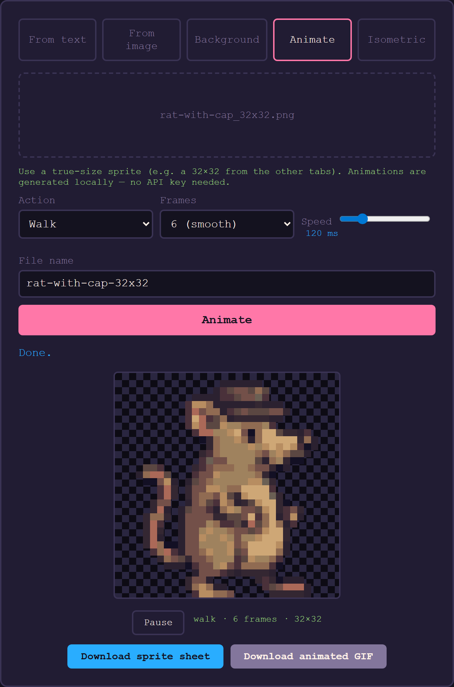
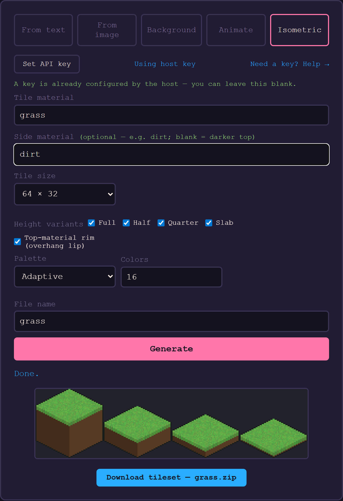
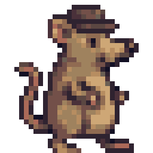
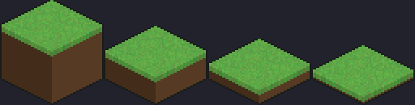

# PixelMaker

Turn words and photos into retro, old-video-game-style pixel art PNGs.

This was a utility I created to generate placeholder pixal images for a game I was working on to teach me about Godot.   Because of this a lot of the decsions are very specific - like pointing to ChatGPT.   It was the first one I tried, it worked and I didn't mess with it.   You should be able to download this and use it against other models.  ALso note that the art generated here is "passible" for a novice game designer or as placeholders.  It is quick, but artwise it is nothing next to the amazing art generated by human artists.  Support them.

> [!WARNING]
> **Unsupported project.** This is a personal hobby project provided **as-is**, with
> **no support, warranty, or guarantee of maintenance**. It may change or break at any
> time. Use at your own risk. Issues and pull requests may go unanswered. You are
> responsible for your own OpenAI API usage and any costs it incurs.

Two modes:

- **From text** — type a subject (e.g. `alligator`) and an AI image model generates
  a retro sprite, which is then pixelated/quantized locally. Requires an OpenAI API key.
- **From image** — upload a photo and convert it to pixel art entirely locally
  (downscale + palette quantization). No API key or network required.
- **Background** — type a scene (e.g. `forest at dusk`) and generate a simple pixel-art
  background (default **1280×720**) via AI. Optionally make it **seamlessly tile
  horizontally**, and generate a smaller repeatable tile (½ or ¼ width) to reduce size.
- **Walk cycle** — upload a true-size sprite and generate looping animations
  (walk, idle, jump, attack) entirely locally (no API key). Preview them live in the
  browser, then download a sprite sheet (for LibreSprite/Aseprite) and an animated GIF.
- **Isometric** — type a material (e.g. `grass`) and generate a clean **2:1 isometric
  tile** plus **full / half / quarter / slab** height variants in the same style.
  Exports individual tiles, a packed atlas, and a ready-to-import **Godot 4 TileSet**.

## Screenshots

| Controls | Result |
|----------|--------|
|  |  |

Generate from a word, pick size/palette/colors, get a transparent, frame-filling sprite
plus a true-size download for LibreSprite/Aseprite.

| Animate (walk / idle / jump / attack) | Isometric tiles |
|----------|--------|
|  |  |

Turn a single sprite into a looping animation previewed live in the browser, or snap an
AI texture onto clean 2:1 isometric geometry to build a Godot-ready tileset.

## Quick start

You need **Python 3.10+** ([download](https://www.python.org/downloads/)). Then:

**Windows (PowerShell):**

```powershell
git clone <your-repo-url> pixelmaker
cd pixelmaker
./run.ps1
```

**macOS / Linux:**

```bash
git clone <your-repo-url> pixelmaker
cd pixelmaker
chmod +x run.sh   # first time only
./run.sh
```

The launcher creates a virtual environment, installs dependencies, starts the server,
and opens http://127.0.0.1:8000 in your browser. Re-run the same script any time to
start it again.

> The **From image** tab works immediately. For the **From text** tab, click
> **Set API key** in the app and paste your own OpenAI key (see the Help page).

To use a different address/port: `./run.ps1 -BindHost 0.0.0.0 -Port 9000`
(PowerShell) or `HOST=0.0.0.0 PORT=9000 ./run.sh`.

## How it works

The core engine (`app/pixelate.py`) is the same for both modes:

1. **Remove background** (optional): detect the flat border color and flood-fill it to
   transparency, so the subject sits on a transparent background.
2. **Fill frame** (optional): trim to the subject's bounding box and pad to a square so it
   fills the grid edge-to-edge (no wasted blank space; aspect ratio preserved).
3. Downscale to a small grid (16/32/64/128, default **32×32**).
4. Quantize colors — either an **adaptive** palette (choose color count) or a fixed
   retro palette (**NES**, **Game Boy**, **CGA**, **PICO-8**). Alpha is preserved.
5. Upscale back with nearest-neighbor sampling so pixels stay crisp.

Both options are on by default and exposed as checkboxes in the UI
("Transparent background" and "Fill frame"). The exported sprite PNG is RGBA, so the
transparency carries straight into LibreSprite/Aseprite.

## Manual setup (alternative to the launcher)

If you prefer to run things yourself instead of `run.ps1` / `run.sh`:

```powershell
python -m venv .venv
.\.venv\Scripts\Activate.ps1      # Windows
# source .venv/bin/activate       # macOS / Linux
pip install -r requirements.txt
uvicorn app.main:app --port 8000
```

Then open http://127.0.0.1:8000.

For the **From text** mode, users supply their own OpenAI API key in the UI (stored only
in their browser). Optionally, a host can configure a fallback key by copying
`.env.example` to `.env` and setting:

```
OPENAI_API_KEY=sk-...
```

(Skip this for image-only use, or when each user brings their own key.)

## Run with Docker

```bash
docker build -t pixelmaker .
docker run --rm -p 8000:8000 pixelmaker
```

Then open http://127.0.0.1:8000. To provide a host fallback key:
`docker run --rm -p 8000:8000 -e OPENAI_API_KEY=sk-... pixelmaker`.

## Sharing with others

This app is designed so you can share it and have **each person use their own OpenAI API
key** — you don't pay for their images:

- Run the server (see above) and share the URL.
- Each user opens the **From text** tab and pastes their own `sk-...` key, which is saved
  only in *their* browser (`localStorage`) and sent per-request to call OpenAI. It is never
  stored on the server or logged.
- The built-in **Help & API key setup** page (`/help.html`) walks them through creating a
  key and adding billing.
- If you set a host `OPENAI_API_KEY`, it is used only as a fallback when a user leaves the
  key field blank. To force everyone to use their own key, leave the host key unset.
- The **From image** tab needs no key at all.

## API

| Endpoint | Method | Purpose |
|----------|--------|---------|
| `/api/health` | GET | Status + whether AI is enabled |
| `/api/generate` | POST (form: `prompt`, `size`, `palette`, `colors`, `remove_bg`, `fill`) | Text → pixel art |
| `/api/convert` | POST (multipart: `file`, `size`, `palette`, `colors`, `remove_bg`, `fill`) | Image → pixel art |
| `/api/background` | POST (form: `prompt`, `width`, `height`, `pixel_size`, `palette`, `colors`, `tileable`, `tile_div`) | Text → pixel-art background |
| `/api/walk` | POST (multipart: `file`, `action`, `frames`, `fps_ms`) | Sprite → animation (walk/idle/jump/attack): frames + sheet + GIF |
| `/api/isometric` | POST (form: `prompt`, `side_prompt`, `width`, `palette`, `colors`, `variants`, `rim`, `name`) | Text → 2:1 isometric tileset zip (tiles + atlas + Godot `.tres`) |

The `/api/generate` and `/api/convert` endpoints return JSON:
`{ "size", "preview_png", "sprite_png" }`, where the two PNG fields are base64-encoded.
`preview_png` is a large (512px) crisp upscale for display; `sprite_png` is the
**true-size** grid (e.g. 32×32) for editing. The `/api/background` endpoint returns
`{ "width", "height", "background_png", "tile_png" }` (PNGs base64-encoded; `tile_png`
is `null` unless a repeating tile was produced).

## Editing in a sprite editor (LibreSprite / Aseprite)

The result panel offers two downloads:

- **Download sprite (true size)** — the raw `size×size` PNG (e.g. `alligator_32x32.png`).
  Open this directly in **LibreSprite** or Aseprite; one image pixel maps to one editor
  pixel, so you can paint/edit cleanly. This is the file to keep working on.
- **Download large preview** — the 512px upscaled PNG, handy for sharing or thumbnails.

The **File name** field auto-suggests a name from your prompt (or the uploaded file name)
and is fully editable; it's used as the base for both downloads.

## Backgrounds

The **Background** tab generates a simple pixel-art background from a text prompt
(e.g. `sewer with pipes and garbage`, `forest at dusk`, `night city skyline`) at a
default of **1280×720**.

Controls:

- **Width / Height** — output size (256–3840 px).
- **Pixel size** — how chunky each art "pixel" block is (Fine 4 → Blocky 16).
- **Palette / Colors** — same retro palettes and color limiting as the other tabs.
- **Seamless horizontal tiling** — makes the image repeat left-to-right with no visible
  seam, so you can scroll or tile it horizontally in a game.
- **Tile width** — when tiling, generate a smaller repeatable tile to reduce size:
  - *Full width* — a unique, non-repeating scene that still tiles seamlessly.
  - *Half (×2)* / *Quarter (×4)* — a narrower tile repeated across the width. You also
    get a separate **seamless tile** download (e.g. `sewer_640x720.png`) to repeat in an
    engine, which keeps the stored asset small.

The result panel shows the full background plus, when applicable, a **Download seamless
tile** button alongside **Download background**. Backgrounds are flat (no transparency)
and best suited to simple, low-detail scenes — that's what the AI prompt is tuned for
(no characters, no text, even left-to-right composition).

## Animate (walk / idle / jump / attack)



The **Animate** tab turns a single sprite into a looping animation, **entirely
locally** (no AI / API key). Upload a true-size sprite (e.g. a 32×32 exported from
the other tabs), pick an **Action**, set the playback **speed**, and click
**Animate**. You can also jump straight here from a generated/converted sprite: the
result panel shows an **Animate this ▶** button that sends the true-size sprite to
this tab and animates it in one click.

Actions (all procedural, from one static sprite — see `app/animations.py`):

- **Walk** — looping march; choose **4 frames** (simple) or **6 frames** (smooth).
- **Idle** — gentle breathing bob.
- **Jump** — crouch (squash) → launch (stretch) → airborne (rise + feet tuck) → land.
- **Attack** — anticipation → lunge/swing forward → recover (carries a held weapon
  through the arc, e.g. a character holding a sword).

The engine finds the sprite's bounding box, treats the bottom band as the feet, and
shifts / squashes / shears those regions per frame. Canvases are auto-padded so a hat
at the top edge, an upward jump, or a forward lunge never clips.

The result panel plays the animation **live on a canvas** (crisp nearest-neighbour,
with play/pause and a speed slider) and offers two downloads:

- **Download sprite sheet** — a horizontal strip of the frames at true size. Import it
  in LibreSprite/Aseprite via *File → Import Sprite Sheet* (Horizontal Strip).
- **Download animated GIF** — an upscaled preview for sharing.

> Animations move *existing* pixels, so they can't invent an unseen viewing angle.
> New actions in the sprite's own view (walk, idle, jump, attack) work from one image;
> back / side / isometric directions need a sprite drawn for each direction.

## Isometric tiles



The **Isometric** tab generates clean, game-ready **2:1 isometric tiles** for level
design. Type a material (e.g. `grass`, `stone`, `sand`), optionally a **side material**
(e.g. `dirt`), pick a **tile size** (32×16, 64×32, 128×64) and which **height variants**
to produce, then **Generate**.

How it works (`app/isometric.py`): the AI supplies a flat top-down *texture*, which is
**projected onto an exact diamond mask** — so edges are pixel-perfect and tiles snap
together seamlessly (unlike a raw AI tile, whose organic edges won't tile). The diamond
is extruded straight down for the cube's side faces (shaded left/right for ambient
occlusion). An optional **top-material rim** wraps the top texture a few pixels down
over the sides (the "grass overhang" lip), following the diamond edge. Height variants
(**full / half / quarter / slab**) change only the extrusion depth, so every tile shares
the identical diamond top and lines up on one grid. Colours are quantized to the chosen
palette for a consistent retro look.

Exports — one click downloads a single **`<name>.zip`** containing a folder with
everything:

- **Individual tile PNGs** (one per height variant).
- **Atlas PNG** — a uniform grid, each tile bottom-centre anchored.
- **Godot 4 `.tres` TileSet** — pre-set to Isometric shape, `tile_size = W×W/2`, with the
  atlas wired up. Drop the unzipped folder into your project root, then assign the
  `.tres` to a `TileMapLayer` (enable Y-Sort for depth).
- **Import-notes** text file listing the exact values for manual setup.

> Phase 1 covers the base cube + height variants. Steps/stairs, cliffs, material
> edge/corner autotiles, and slopes are natural follow-ons.

## Tests

```powershell
pip install pytest
pytest
```

Tests cover the pixelation engine, palettes, the animation system (walk/idle/
jump/attack), and the isometric tile generator offline (no network/AI).

## Notes

- Built for a Snapdragon X (ARM64) machine — uses a hosted image API instead of local
  Stable Diffusion (no CUDA GPU). All image processing is local and ARM64-friendly.
- Secrets live only in `.env`, which is gitignored.

## License

Released under the [PolyForm Noncommercial License 1.0.0](LICENSE). **Commercial use is
not permitted.** You may use, modify, and share the software for any noncommercial
purpose (personal projects, hobby, research, education, etc.). For commercial licensing,
contact the author.

## Disclaimer

This project is **not supported**. It is provided as-is for personal/noncommercial use
with no warranty or guarantee of maintenance (see the warning at the top and the
[license](LICENSE)). You are solely responsible for your use of any third-party APIs
(e.g. OpenAI) and any associated costs.
